# Architecture Base de Données — FacturaPro Maroc

> Conformité Article 210 CGI · Multi-utilisateurs · PostgreSQL (Lovable Cloud)

---

## 1. Diagramme Entité-Relation

```mermaid
erDiagram
    auth_users ||--|| profiles : "1:1"
    profiles ||--o{ user_roles : "has roles"
    
    company_settings ||--o{ profiles : "employs"
    company_settings ||--o{ clients : "owns"
    company_settings ||--o{ products : "catalogs"
    company_settings ||--o{ invoices : "issues"
    company_settings ||--o{ devis : "quotes"
    company_settings ||--o{ bon_commande : "orders"
    company_settings ||--o{ bon_livraison : "delivers"
    company_settings ||--o{ achats : "purchases"
    company_settings ||--o{ expenses : "spends"

    clients ||--o{ invoices : "billed"
    clients ||--o{ devis : "quoted"
    clients ||--o{ bon_commande : "ordered"
    clients ||--o{ bon_livraison : "delivered"

    invoices ||--o{ invoice_lines : "contains"
    invoices ||--o{ payments : "paid by"
    invoices ||--o| invoices : "avoir_of"

    devis ||--o{ devis_lines : "contains"
    bon_commande ||--o{ bc_lines : "contains"
    bon_livraison ||--o{ bl_lines : "contains"
    achats ||--o{ achat_lines : "contains"

    products ||--o{ invoice_lines : "sold as"
    products ||--o{ devis_lines : "quoted as"
    products ||--o{ bc_lines : "ordered as"
    products ||--o{ bl_lines : "delivered as"
    products ||--o{ achat_lines : "purchased as"
    products ||--o{ stock_movements : "tracked"

    profiles ||--o{ audit_logs : "performed"

    profiles {
        uuid id PK "= auth.users.id"
        text full_name
        text phone
        text avatar_url
        uuid company_id FK
        timestamptz created_at
        timestamptz updated_at
    }

    user_roles {
        uuid id PK
        uuid user_id FK
        app_role role "admin | agent | comptable"
        timestamptz created_at
    }

    company_settings {
        uuid id PK
        text company_name
        text ice "15 digits"
        text if_number
        text rc
        text patente
        text cnss
        text capital_social
        text address
        text city
        text phone
        text email
        text website
        text rib_iban
        text bank_name
        text logo_base64
        uuid created_by FK
        timestamptz created_at
        timestamptz updated_at
    }

    clients {
        uuid id PK
        uuid company_id FK
        client_type type "company | individual"
        text business_name
        text ice
        text if_number
        text rc
        text address
        text city
        text email
        text phone
        uuid created_by FK
        timestamptz created_at
        timestamptz updated_at
    }

    products {
        uuid id PK
        uuid company_id FK
        text reference "ART-0001"
        text name
        text description
        numeric unit_price
        smallint vat_rate "0,7,10,14,20"
        text unit
        integer stock
        integer min_stock_threshold
        uuid created_by FK
        timestamptz created_at
        timestamptz updated_at
    }

    invoices {
        uuid id PK
        uuid company_id FK
        text number "FA-YYYY-NNNN"
        date invoice_date
        date due_date
        uuid client_id FK
        invoice_status status
        text notes
        text payment_method
        text payment_ref
        numeric subtotal_ht
        jsonb vat_breakdown
        numeric total_tva
        numeric total_ttc
        numeric timbre
        text hash "SHA-256"
        text previous_hash
        text signature "HMAC-SHA256"
        uuid original_invoice_id FK "for Avoir"
        boolean has_avoir
        uuid avoir_id FK
        numeric total_paid
        uuid bl_id FK
        dgi_status dgi_status
        text dgi_registration_number
        text signed_pdf_url
        uuid created_by FK
        uuid validated_by FK
        timestamptz created_at
        timestamptz updated_at
    }

    invoice_lines {
        uuid id PK
        uuid invoice_id FK
        uuid product_id FK
        text description
        numeric quantity
        numeric unit_price
        smallint vat_rate
        numeric line_total_ht
        integer sort_order
    }

    payments {
        uuid id PK
        uuid invoice_id FK
        numeric amount
        date payment_date
        text method
        text reference
        uuid created_by FK
        timestamptz created_at
    }

    devis {
        uuid id PK
        uuid company_id FK
        text number "DV-YYYY-NNNN"
        date devis_date
        date validity_date
        uuid client_id FK
        devis_status status
        text notes
        text payment_method
        numeric subtotal_ht
        jsonb vat_breakdown
        numeric total_tva
        numeric total_ttc
        boolean is_converted
        uuid converted_bc_id FK
        uuid created_by FK
        timestamptz created_at
        timestamptz updated_at
    }

    devis_lines {
        uuid id PK
        uuid devis_id FK
        uuid product_id FK
        text description
        numeric quantity
        numeric unit_price
        smallint vat_rate
        numeric line_total_ht
        integer sort_order
    }

    bon_commande {
        uuid id PK
        uuid company_id FK
        text number "BC-YYYY-NNNN"
        date bc_date
        uuid client_id FK
        bc_status status
        text notes
        text payment_method
        numeric subtotal_ht
        jsonb vat_breakdown
        numeric total_tva
        numeric total_ttc
        boolean is_converted
        uuid source_devis_id FK
        uuid converted_bl_id FK
        uuid created_by FK
        timestamptz created_at
        timestamptz updated_at
    }

    bc_lines {
        uuid id PK
        uuid bc_id FK
        uuid product_id FK
        text description
        numeric quantity
        numeric unit_price
        smallint vat_rate
        numeric line_total_ht
        integer sort_order
    }

    bon_livraison {
        uuid id PK
        uuid company_id FK
        text number "BL-YYYY-NNNN"
        date bl_date
        uuid client_id FK
        bl_status status
        text notes
        numeric subtotal_ht
        jsonb vat_breakdown
        numeric total_tva
        numeric total_ttc
        boolean is_converted
        uuid source_bc_id FK
        uuid source_invoice_id FK
        uuid linked_invoice_id FK
        uuid created_by FK
        timestamptz created_at
        timestamptz updated_at
    }

    bl_lines {
        uuid id PK
        uuid bl_id FK
        uuid product_id FK
        text description
        numeric quantity
        numeric unit_price
        smallint vat_rate
        numeric line_total_ht
        integer sort_order
    }

    achats {
        uuid id PK
        uuid company_id FK
        text number "ACH-YYYY-NNNN"
        date achat_date
        text supplier_name
        text supplier_ice
        text supplier_if
        achat_status status
        text payment_method
        text payment_ref
        numeric subtotal_ht
        jsonb vat_breakdown
        numeric total_tva
        numeric total_ttc
        uuid created_by FK
        timestamptz created_at
        timestamptz updated_at
    }

    achat_lines {
        uuid id PK
        uuid achat_id FK
        uuid product_id FK
        text description
        numeric quantity
        numeric unit_price
        smallint vat_rate
        numeric line_total_ht
        integer sort_order
    }

    stock_movements {
        uuid id PK
        uuid product_id FK
        uuid company_id FK
        date movement_date
        movement_type type "sale|purchase|return|manual"
        integer quantity "signed"
        integer new_balance
        text document_ref
        uuid created_by FK
        timestamptz created_at
    }

    expenses {
        uuid id PK
        uuid company_id FK
        date expense_date
        text category
        text description
        numeric amount
        text payment_method
        text reference
        uuid created_by FK
        timestamptz created_at
        timestamptz updated_at
    }

    audit_logs {
        uuid id PK
        uuid user_id FK
        text user_name
        text action
        text document_type
        uuid document_id
        text document_number
        text details
        jsonb old_value
        jsonb new_value
        inet ip_address
        timestamptz created_at
    }

    closed_fiscal_years {
        uuid id PK
        uuid company_id FK
        integer year
        text master_hash
        uuid closed_by FK
        timestamptz closed_at
    }
```



---

## 2. Enums & Types

```sql
-- ══════════════════════════════════════════════
-- ENUMS
-- ══════════════════════════════════════════════

CREATE TYPE public.app_role AS ENUM ('admin', 'agent', 'comptable');

CREATE TYPE public.client_type AS ENUM ('company', 'individual');

CREATE TYPE public.invoice_status AS ENUM (
  'draft', 'pending', 'validated', 'paid', 'cancelled', 'avoir'
);

CREATE TYPE public.devis_status AS ENUM (
  'draft', 'sent', 'accepted', 'rejected', 'expired', 'converted'
);

CREATE TYPE public.bc_status AS ENUM (
  'draft', 'confirmed', 'converted', 'cancelled'
);

CREATE TYPE public.bl_status AS ENUM (
  'draft', 'delivered', 'converted', 'cancelled'
);

CREATE TYPE public.achat_status AS ENUM (
  'draft', 'validated', 'paid', 'cancelled'
);

CREATE TYPE public.dgi_status AS ENUM (
  'pending', 'accepted', 'rejected', 'manual'
);

CREATE TYPE public.movement_type AS ENUM (
  'sale', 'purchase', 'return', 'manual'
);
```

---

## 3. Tables

### 3.1 — Identity & Roles

```sql
-- ══════════════════════════════════════════════
-- PROFILES (1:1 with auth.users)
-- ══════════════════════════════════════════════
CREATE TABLE public.profiles (
  id          UUID PRIMARY KEY REFERENCES auth.users(id) ON DELETE CASCADE,
  full_name   TEXT NOT NULL DEFAULT '',
  phone       TEXT,
  avatar_url  TEXT,
  company_id  UUID,  -- FK added after company_settings exists
  created_at  TIMESTAMPTZ NOT NULL DEFAULT now(),
  updated_at  TIMESTAMPTZ NOT NULL DEFAULT now()
);

ALTER TABLE public.profiles ENABLE ROW LEVEL SECURITY;

-- Auto-create profile on signup
CREATE OR REPLACE FUNCTION public.handle_new_user()
RETURNS TRIGGER
LANGUAGE plpgsql
SECURITY DEFINER
SET search_path = public
AS $$
BEGIN
  INSERT INTO public.profiles (id, full_name)
  VALUES (NEW.id, COALESCE(NEW.raw_user_meta_data ->> 'full_name', ''));
  RETURN NEW;
END;
$$;

CREATE TRIGGER on_auth_user_created
  AFTER INSERT ON auth.users
  FOR EACH ROW EXECUTE FUNCTION public.handle_new_user();

-- ══════════════════════════════════════════════
-- USER ROLES (separate table — prevents privilege escalation)
-- ══════════════════════════════════════════════
CREATE TABLE public.user_roles (
  id         UUID PRIMARY KEY DEFAULT gen_random_uuid(),
  user_id    UUID NOT NULL REFERENCES auth.users(id) ON DELETE CASCADE,
  role       public.app_role NOT NULL,
  created_at TIMESTAMPTZ NOT NULL DEFAULT now(),
  UNIQUE (user_id, role)
);

ALTER TABLE public.user_roles ENABLE ROW LEVEL SECURITY;
```

### 3.2 — Company Settings

```sql
-- ══════════════════════════════════════════════
-- COMPANY SETTINGS
-- ══════════════════════════════════════════════
CREATE TABLE public.company_settings (
  id              UUID PRIMARY KEY DEFAULT gen_random_uuid(),
  company_name    TEXT NOT NULL DEFAULT '',
  ice             TEXT,          -- 15-digit Moroccan ICE
  if_number       TEXT,
  rc              TEXT,
  patente         TEXT,
  cnss            TEXT,
  capital_social  TEXT,
  address         TEXT,
  city            TEXT,
  phone           TEXT,
  email           TEXT,
  website         TEXT,
  rib_iban        TEXT,
  bank_name       TEXT,
  logo_base64     TEXT,
  created_by      UUID REFERENCES auth.users(id),
  created_at      TIMESTAMPTZ NOT NULL DEFAULT now(),
  updated_at      TIMESTAMPTZ NOT NULL DEFAULT now()
);

ALTER TABLE public.company_settings ENABLE ROW LEVEL SECURITY;

-- Now add the FK on profiles
ALTER TABLE public.profiles
  ADD CONSTRAINT fk_profiles_company
  FOREIGN KEY (company_id) REFERENCES public.company_settings(id);
```

### 3.3 — Clients

```sql
CREATE TABLE public.clients (
  id             UUID PRIMARY KEY DEFAULT gen_random_uuid(),
  company_id     UUID NOT NULL REFERENCES public.company_settings(id),
  client_type    public.client_type NOT NULL DEFAULT 'company',
  business_name  TEXT NOT NULL,
  ice            TEXT,
  if_number      TEXT,
  rc             TEXT,
  address        TEXT NOT NULL DEFAULT '',
  city           TEXT NOT NULL DEFAULT '',
  email          TEXT,
  phone          TEXT,
  created_by     UUID REFERENCES auth.users(id),
  created_at     TIMESTAMPTZ NOT NULL DEFAULT now(),
  updated_at     TIMESTAMPTZ NOT NULL DEFAULT now()
);

ALTER TABLE public.clients ENABLE ROW LEVEL SECURITY;
CREATE INDEX idx_clients_company ON public.clients(company_id);
CREATE INDEX idx_clients_ice ON public.clients(ice) WHERE ice IS NOT NULL;
```

### 3.4 — Products

```sql
CREATE TABLE public.products (
  id                  UUID PRIMARY KEY DEFAULT gen_random_uuid(),
  company_id          UUID NOT NULL REFERENCES public.company_settings(id),
  reference           TEXT NOT NULL,
  name                TEXT NOT NULL,
  description         TEXT,
  unit_price          NUMERIC(12,2) NOT NULL DEFAULT 0,
  vat_rate            SMALLINT NOT NULL DEFAULT 20
                        CHECK (vat_rate IN (0, 7, 10, 14, 20)),
  unit                TEXT DEFAULT 'Unité',
  stock               INTEGER NOT NULL DEFAULT 0,
  min_stock_threshold INTEGER NOT NULL DEFAULT 5,
  created_by          UUID REFERENCES auth.users(id),
  created_at          TIMESTAMPTZ NOT NULL DEFAULT now(),
  updated_at          TIMESTAMPTZ NOT NULL DEFAULT now(),
  UNIQUE (company_id, reference)
);

ALTER TABLE public.products ENABLE ROW LEVEL SECURITY;
CREATE INDEX idx_products_company ON public.products(company_id);
```

### 3.5 — Invoices & Lines

```sql
CREATE TABLE public.invoices (
  id                      UUID PRIMARY KEY DEFAULT gen_random_uuid(),
  company_id              UUID NOT NULL REFERENCES public.company_settings(id),
  number                  TEXT NOT NULL DEFAULT 'BROUILLON',
  invoice_date            DATE NOT NULL DEFAULT CURRENT_DATE,
  due_date                DATE NOT NULL DEFAULT CURRENT_DATE,
  client_id               UUID NOT NULL REFERENCES public.clients(id),
  status                  public.invoice_status NOT NULL DEFAULT 'draft',
  notes                   TEXT,
  payment_method          TEXT,
  payment_ref             TEXT,
  -- Computed totals stored for performance
  subtotal_ht             NUMERIC(14,2) NOT NULL DEFAULT 0,
  vat_breakdown           JSONB NOT NULL DEFAULT '[]',
  total_tva               NUMERIC(14,2) NOT NULL DEFAULT 0,
  total_ttc               NUMERIC(14,2) NOT NULL DEFAULT 0,
  timbre                  NUMERIC(10,2) NOT NULL DEFAULT 0,
  -- Art. 210 CGI cryptographic chain
  hash                    TEXT,
  previous_hash           TEXT,
  signature               TEXT,
  -- Avoir link
  original_invoice_id     UUID REFERENCES public.invoices(id),
  has_avoir               BOOLEAN NOT NULL DEFAULT FALSE,
  avoir_id                UUID REFERENCES public.invoices(id),
  -- Payments
  total_paid              NUMERIC(14,2) NOT NULL DEFAULT 0,
  -- BL link
  bl_id                   UUID,  -- FK added after bon_livraison exists
  -- DGI e-Facture
  dgi_status              public.dgi_status,
  dgi_registration_number TEXT,
  signed_pdf_url          TEXT,
  -- Metadata
  created_by              UUID REFERENCES auth.users(id),
  validated_by            UUID REFERENCES auth.users(id),
  created_at              TIMESTAMPTZ NOT NULL DEFAULT now(),
  updated_at              TIMESTAMPTZ NOT NULL DEFAULT now()
);

ALTER TABLE public.invoices ENABLE ROW LEVEL SECURITY;
CREATE INDEX idx_invoices_company ON public.invoices(company_id);
CREATE INDEX idx_invoices_client ON public.invoices(client_id);
CREATE INDEX idx_invoices_status ON public.invoices(status);
CREATE UNIQUE INDEX idx_invoices_number_unique
  ON public.invoices(company_id, number)
  WHERE number <> 'BROUILLON';

-- ── Invoice Lines ──
CREATE TABLE public.invoice_lines (
  id            UUID PRIMARY KEY DEFAULT gen_random_uuid(),
  invoice_id    UUID NOT NULL REFERENCES public.invoices(id) ON DELETE CASCADE,
  product_id    UUID REFERENCES public.products(id),
  description   TEXT NOT NULL,
  quantity      NUMERIC(10,3) NOT NULL DEFAULT 1,
  unit_price    NUMERIC(12,2) NOT NULL DEFAULT 0,
  vat_rate      SMALLINT NOT NULL DEFAULT 20
                  CHECK (vat_rate IN (0, 7, 10, 14, 20)),
  line_total_ht NUMERIC(14,2) GENERATED ALWAYS AS (quantity * unit_price) STORED,
  sort_order    INTEGER NOT NULL DEFAULT 0
);

ALTER TABLE public.invoice_lines ENABLE ROW LEVEL SECURITY;
CREATE INDEX idx_invoice_lines_invoice ON public.invoice_lines(invoice_id);
```

### 3.6 — Payments

```sql
CREATE TABLE public.payments (
  id            UUID PRIMARY KEY DEFAULT gen_random_uuid(),
  invoice_id    UUID NOT NULL REFERENCES public.invoices(id) ON DELETE CASCADE,
  amount        NUMERIC(14,2) NOT NULL,
  payment_date  DATE NOT NULL DEFAULT CURRENT_DATE,
  method        TEXT NOT NULL,
  reference     TEXT,
  created_by    UUID REFERENCES auth.users(id),
  created_at    TIMESTAMPTZ NOT NULL DEFAULT now()
);

ALTER TABLE public.payments ENABLE ROW LEVEL SECURITY;
CREATE INDEX idx_payments_invoice ON public.payments(invoice_id);
```

### 3.7 — Devis (Quotes)

```sql
CREATE TABLE public.devis (
  id              UUID PRIMARY KEY DEFAULT gen_random_uuid(),
  company_id      UUID NOT NULL REFERENCES public.company_settings(id),
  number          TEXT NOT NULL,
  devis_date      DATE NOT NULL DEFAULT CURRENT_DATE,
  validity_date   DATE,
  client_id       UUID NOT NULL REFERENCES public.clients(id),
  status          public.devis_status NOT NULL DEFAULT 'draft',
  notes           TEXT,
  payment_method  TEXT,
  subtotal_ht     NUMERIC(14,2) NOT NULL DEFAULT 0,
  vat_breakdown   JSONB NOT NULL DEFAULT '[]',
  total_tva       NUMERIC(14,2) NOT NULL DEFAULT 0,
  total_ttc       NUMERIC(14,2) NOT NULL DEFAULT 0,
  is_converted    BOOLEAN NOT NULL DEFAULT FALSE,
  converted_bc_id UUID,
  created_by      UUID REFERENCES auth.users(id),
  created_at      TIMESTAMPTZ NOT NULL DEFAULT now(),
  updated_at      TIMESTAMPTZ NOT NULL DEFAULT now()
);

ALTER TABLE public.devis ENABLE ROW LEVEL SECURITY;

CREATE TABLE public.devis_lines (
  id            UUID PRIMARY KEY DEFAULT gen_random_uuid(),
  devis_id      UUID NOT NULL REFERENCES public.devis(id) ON DELETE CASCADE,
  product_id    UUID REFERENCES public.products(id),
  description   TEXT NOT NULL,
  quantity      NUMERIC(10,3) NOT NULL DEFAULT 1,
  unit_price    NUMERIC(12,2) NOT NULL DEFAULT 0,
  vat_rate      SMALLINT NOT NULL DEFAULT 20
                  CHECK (vat_rate IN (0, 7, 10, 14, 20)),
  line_total_ht NUMERIC(14,2) GENERATED ALWAYS AS (quantity * unit_price) STORED,
  sort_order    INTEGER NOT NULL DEFAULT 0
);

ALTER TABLE public.devis_lines ENABLE ROW LEVEL SECURITY;
```

### 3.8 — Bon de Commande (Purchase Orders)

```sql
CREATE TABLE public.bon_commande (
  id              UUID PRIMARY KEY DEFAULT gen_random_uuid(),
  company_id      UUID NOT NULL REFERENCES public.company_settings(id),
  number          TEXT NOT NULL,
  bc_date         DATE NOT NULL DEFAULT CURRENT_DATE,
  client_id       UUID NOT NULL REFERENCES public.clients(id),
  status          public.bc_status NOT NULL DEFAULT 'draft',
  notes           TEXT,
  payment_method  TEXT,
  subtotal_ht     NUMERIC(14,2) NOT NULL DEFAULT 0,
  vat_breakdown   JSONB NOT NULL DEFAULT '[]',
  total_tva       NUMERIC(14,2) NOT NULL DEFAULT 0,
  total_ttc       NUMERIC(14,2) NOT NULL DEFAULT 0,
  is_converted    BOOLEAN NOT NULL DEFAULT FALSE,
  source_devis_id UUID REFERENCES public.devis(id),
  converted_bl_id UUID,
  created_by      UUID REFERENCES auth.users(id),
  created_at      TIMESTAMPTZ NOT NULL DEFAULT now(),
  updated_at      TIMESTAMPTZ NOT NULL DEFAULT now()
);

ALTER TABLE public.bon_commande ENABLE ROW LEVEL SECURITY;

CREATE TABLE public.bc_lines (
  id            UUID PRIMARY KEY DEFAULT gen_random_uuid(),
  bc_id         UUID NOT NULL REFERENCES public.bon_commande(id) ON DELETE CASCADE,
  product_id    UUID REFERENCES public.products(id),
  description   TEXT NOT NULL,
  quantity      NUMERIC(10,3) NOT NULL DEFAULT 1,
  unit_price    NUMERIC(12,2) NOT NULL DEFAULT 0,
  vat_rate      SMALLINT NOT NULL DEFAULT 20
                  CHECK (vat_rate IN (0, 7, 10, 14, 20)),
  line_total_ht NUMERIC(14,2) GENERATED ALWAYS AS (quantity * unit_price) STORED,
  sort_order    INTEGER NOT NULL DEFAULT 0
);

ALTER TABLE public.bc_lines ENABLE ROW LEVEL SECURITY;
```

### 3.9 — Bon de Livraison (Delivery Notes)

```sql
CREATE TABLE public.bon_livraison (
  id                UUID PRIMARY KEY DEFAULT gen_random_uuid(),
  company_id        UUID NOT NULL REFERENCES public.company_settings(id),
  number            TEXT NOT NULL,
  bl_date           DATE NOT NULL DEFAULT CURRENT_DATE,
  client_id         UUID NOT NULL REFERENCES public.clients(id),
  status            public.bl_status NOT NULL DEFAULT 'draft',
  notes             TEXT,
  subtotal_ht       NUMERIC(14,2) NOT NULL DEFAULT 0,
  vat_breakdown     JSONB NOT NULL DEFAULT '[]',
  total_tva         NUMERIC(14,2) NOT NULL DEFAULT 0,
  total_ttc         NUMERIC(14,2) NOT NULL DEFAULT 0,
  is_converted      BOOLEAN NOT NULL DEFAULT FALSE,
  source_bc_id      UUID REFERENCES public.bon_commande(id),
  source_invoice_id UUID REFERENCES public.invoices(id),
  linked_invoice_id UUID REFERENCES public.invoices(id),
  created_by        UUID REFERENCES auth.users(id),
  created_at        TIMESTAMPTZ NOT NULL DEFAULT now(),
  updated_at        TIMESTAMPTZ NOT NULL DEFAULT now()
);

ALTER TABLE public.bon_livraison ENABLE ROW LEVEL SECURITY;

-- Now add FK on invoices.bl_id
ALTER TABLE public.invoices
  ADD CONSTRAINT fk_invoices_bl
  FOREIGN KEY (bl_id) REFERENCES public.bon_livraison(id);

CREATE TABLE public.bl_lines (
  id            UUID PRIMARY KEY DEFAULT gen_random_uuid(),
  bl_id         UUID NOT NULL REFERENCES public.bon_livraison(id) ON DELETE CASCADE,
  product_id    UUID REFERENCES public.products(id),
  description   TEXT NOT NULL,
  quantity      NUMERIC(10,3) NOT NULL DEFAULT 1,
  unit_price    NUMERIC(12,2) NOT NULL DEFAULT 0,
  vat_rate      SMALLINT NOT NULL DEFAULT 20
                  CHECK (vat_rate IN (0, 7, 10, 14, 20)),
  line_total_ht NUMERIC(14,2) GENERATED ALWAYS AS (quantity * unit_price) STORED,
  sort_order    INTEGER NOT NULL DEFAULT 0
);

ALTER TABLE public.bl_lines ENABLE ROW LEVEL SECURITY;
```

### 3.10 — Achats (Purchases)

```sql
CREATE TABLE public.achats (
  id              UUID PRIMARY KEY DEFAULT gen_random_uuid(),
  company_id      UUID NOT NULL REFERENCES public.company_settings(id),
  number          TEXT NOT NULL,
  achat_date      DATE NOT NULL DEFAULT CURRENT_DATE,
  supplier_name   TEXT NOT NULL,
  supplier_ice    TEXT,
  supplier_if     TEXT,
  status          public.achat_status NOT NULL DEFAULT 'draft',
  payment_method  TEXT,
  payment_ref     TEXT,
  subtotal_ht     NUMERIC(14,2) NOT NULL DEFAULT 0,
  vat_breakdown   JSONB NOT NULL DEFAULT '[]',
  total_tva       NUMERIC(14,2) NOT NULL DEFAULT 0,
  total_ttc       NUMERIC(14,2) NOT NULL DEFAULT 0,
  created_by      UUID REFERENCES auth.users(id),
  created_at      TIMESTAMPTZ NOT NULL DEFAULT now(),
  updated_at      TIMESTAMPTZ NOT NULL DEFAULT now()
);

ALTER TABLE public.achats ENABLE ROW LEVEL SECURITY;

CREATE TABLE public.achat_lines (
  id            UUID PRIMARY KEY DEFAULT gen_random_uuid(),
  achat_id      UUID NOT NULL REFERENCES public.achats(id) ON DELETE CASCADE,
  product_id    UUID REFERENCES public.products(id),
  description   TEXT NOT NULL,
  quantity      NUMERIC(10,3) NOT NULL DEFAULT 1,
  unit_price    NUMERIC(12,2) NOT NULL DEFAULT 0,
  vat_rate      SMALLINT NOT NULL DEFAULT 20
                  CHECK (vat_rate IN (0, 7, 10, 14, 20)),
  line_total_ht NUMERIC(14,2) GENERATED ALWAYS AS (quantity * unit_price) STORED,
  sort_order    INTEGER NOT NULL DEFAULT 0
);

ALTER TABLE public.achat_lines ENABLE ROW LEVEL SECURITY;
```

### 3.11 — Stock Movements

```sql
CREATE TABLE public.stock_movements (
  id            UUID PRIMARY KEY DEFAULT gen_random_uuid(),
  product_id    UUID NOT NULL REFERENCES public.products(id) ON DELETE CASCADE,
  company_id    UUID NOT NULL REFERENCES public.company_settings(id),
  movement_date TIMESTAMPTZ NOT NULL DEFAULT now(),
  type          public.movement_type NOT NULL,
  quantity      INTEGER NOT NULL,  -- positive = in, negative = out
  new_balance   INTEGER NOT NULL,
  document_ref  TEXT,
  created_by    UUID REFERENCES auth.users(id),
  created_at    TIMESTAMPTZ NOT NULL DEFAULT now()
);

ALTER TABLE public.stock_movements ENABLE ROW LEVEL SECURITY;
CREATE INDEX idx_stock_movements_product ON public.stock_movements(product_id);
```

### 3.12 — Expenses

```sql
CREATE TABLE public.expenses (
  id              UUID PRIMARY KEY DEFAULT gen_random_uuid(),
  company_id      UUID NOT NULL REFERENCES public.company_settings(id),
  expense_date    DATE NOT NULL DEFAULT CURRENT_DATE,
  category        TEXT NOT NULL,
  description     TEXT,
  amount          NUMERIC(14,2) NOT NULL,
  payment_method  TEXT,
  reference       TEXT,
  created_by      UUID REFERENCES auth.users(id),
  created_at      TIMESTAMPTZ NOT NULL DEFAULT now(),
  updated_at      TIMESTAMPTZ NOT NULL DEFAULT now()
);

ALTER TABLE public.expenses ENABLE ROW LEVEL SECURITY;
CREATE INDEX idx_expenses_company ON public.expenses(company_id);
```

### 3.13 — Audit Logs (Append-Only)

```sql
CREATE TABLE public.audit_logs (
  id               UUID PRIMARY KEY DEFAULT gen_random_uuid(),
  user_id          UUID REFERENCES auth.users(id),
  user_name        TEXT NOT NULL,
  action           TEXT NOT NULL,
  document_type    TEXT NOT NULL,
  document_id      UUID,
  document_number  TEXT,
  details          TEXT,
  old_value        JSONB,
  new_value        JSONB,
  ip_address       INET,
  created_at       TIMESTAMPTZ NOT NULL DEFAULT now()
);

ALTER TABLE public.audit_logs ENABLE ROW LEVEL SECURITY;
CREATE INDEX idx_audit_logs_user ON public.audit_logs(user_id);
CREATE INDEX idx_audit_logs_created ON public.audit_logs(created_at DESC);

-- ⛔ IMMUTABILITY: Block UPDATE and DELETE on audit_logs
CREATE OR REPLACE FUNCTION public.prevent_audit_mutation()
RETURNS TRIGGER
LANGUAGE plpgsql
AS $$
BEGIN
  RAISE EXCEPTION 'audit_logs is append-only. UPDATE and DELETE are forbidden.';
END;
$$;

CREATE TRIGGER trg_audit_no_update
  BEFORE UPDATE ON public.audit_logs
  FOR EACH ROW EXECUTE FUNCTION public.prevent_audit_mutation();

CREATE TRIGGER trg_audit_no_delete
  BEFORE DELETE ON public.audit_logs
  FOR EACH ROW EXECUTE FUNCTION public.prevent_audit_mutation();
```

### 3.14 — Closed Fiscal Years

```sql
CREATE TABLE public.closed_fiscal_years (
  id          UUID PRIMARY KEY DEFAULT gen_random_uuid(),
  company_id  UUID NOT NULL REFERENCES public.company_settings(id),
  year        INTEGER NOT NULL,
  master_hash TEXT,
  closed_by   UUID REFERENCES auth.users(id),
  closed_at   TIMESTAMPTZ NOT NULL DEFAULT now(),
  UNIQUE (company_id, year)
);

ALTER TABLE public.closed_fiscal_years ENABLE ROW LEVEL SECURITY;
```

---

## 4. Security-Definer Helper Functions

```sql
-- ══════════════════════════════════════════════
-- ROLE CHECKER (avoids RLS recursion)
-- ══════════════════════════════════════════════
CREATE OR REPLACE FUNCTION public.has_role(_user_id UUID, _role public.app_role)
RETURNS BOOLEAN
LANGUAGE sql
STABLE
SECURITY DEFINER
SET search_path = public
AS $$
  SELECT EXISTS (
    SELECT 1 FROM public.user_roles
    WHERE user_id = _user_id AND role = _role
  );
$$;

-- Convenience wrappers
CREATE OR REPLACE FUNCTION public.is_admin()
RETURNS BOOLEAN LANGUAGE sql STABLE SECURITY DEFINER SET search_path = public
AS $$ SELECT public.has_role(auth.uid(), 'admin'); $$;

CREATE OR REPLACE FUNCTION public.is_agent()
RETURNS BOOLEAN LANGUAGE sql STABLE SECURITY DEFINER SET search_path = public
AS $$ SELECT public.has_role(auth.uid(), 'agent'); $$;

CREATE OR REPLACE FUNCTION public.is_comptable()
RETURNS BOOLEAN LANGUAGE sql STABLE SECURITY DEFINER SET search_path = public
AS $$ SELECT public.has_role(auth.uid(), 'comptable'); $$;

-- Company membership check
CREATE OR REPLACE FUNCTION public.get_user_company_id()
RETURNS UUID
LANGUAGE sql
STABLE
SECURITY DEFINER
SET search_path = public
AS $$
  SELECT company_id FROM public.profiles WHERE id = auth.uid();
$$;

CREATE OR REPLACE FUNCTION public.is_company_member(_company_id UUID)
RETURNS BOOLEAN
LANGUAGE sql
STABLE
SECURITY DEFINER
SET search_path = public
AS $$
  SELECT public.get_user_company_id() = _company_id;
$$;
```

---

## 5. RLS Policies

```sql
-- ── profiles ──
CREATE POLICY "Users read own or admin reads all" ON public.profiles
  FOR SELECT TO authenticated
  USING (id = auth.uid() OR public.is_admin());

CREATE POLICY "Users update own profile" ON public.profiles
  FOR UPDATE TO authenticated
  USING (id = auth.uid())
  WITH CHECK (id = auth.uid());

-- ── user_roles ──
CREATE POLICY "Only admins manage roles" ON public.user_roles
  FOR ALL TO authenticated
  USING (public.is_admin())
  WITH CHECK (public.is_admin());

-- ── company_settings ──
CREATE POLICY "Company members read settings" ON public.company_settings
  FOR SELECT TO authenticated
  USING (public.is_company_member(id));

CREATE POLICY "Admins manage company settings" ON public.company_settings
  FOR ALL TO authenticated
  USING (public.is_admin() AND public.is_company_member(id))
  WITH CHECK (public.is_admin() AND public.is_company_member(id));

-- ── clients ──
CREATE POLICY "Company members read clients" ON public.clients
  FOR SELECT TO authenticated
  USING (public.is_company_member(company_id));

CREATE POLICY "Admin/Agent manage clients" ON public.clients
  FOR INSERT TO authenticated
  WITH CHECK ((public.is_admin() OR public.is_agent()) AND public.is_company_member(company_id));

CREATE POLICY "Admin/Agent update clients" ON public.clients
  FOR UPDATE TO authenticated
  USING ((public.is_admin() OR public.is_agent()) AND public.is_company_member(company_id));

CREATE POLICY "Admin deletes clients" ON public.clients
  FOR DELETE TO authenticated
  USING (public.is_admin() AND public.is_company_member(company_id));

-- ── invoices ──
CREATE POLICY "Company members read invoices" ON public.invoices
  FOR SELECT TO authenticated
  USING (public.is_company_member(company_id));

CREATE POLICY "Admin/Agent create invoices" ON public.invoices
  FOR INSERT TO authenticated
  WITH CHECK ((public.is_admin() OR public.is_agent()) AND public.is_company_member(company_id));

CREATE POLICY "Admin/Agent update draft invoices" ON public.invoices
  FOR UPDATE TO authenticated
  USING (
    public.is_company_member(company_id)
    AND (
      public.is_admin()
      OR (public.is_agent() AND status = 'draft')
    )
  );

CREATE POLICY "Admin deletes draft invoices" ON public.invoices
  FOR DELETE TO authenticated
  USING (public.is_admin() AND public.is_company_member(company_id) AND status = 'draft');

-- ── audit_logs (append-only) ──
CREATE POLICY "All authenticated read audit" ON public.audit_logs
  FOR SELECT TO authenticated USING (true);

CREATE POLICY "All authenticated insert audit" ON public.audit_logs
  FOR INSERT TO authenticated WITH CHECK (true);
-- No UPDATE/DELETE policies + trigger blocks mutations
```

> **Note**: The same `SELECT` + `INSERT/UPDATE/DELETE` pattern from `clients` applies to `products`, `devis`, `devis_lines`, `bon_commande`, `bc_lines`, `bon_livraison`, `bl_lines`, `achats`, `achat_lines`, `invoice_lines`, `payments`, `stock_movements`, `expenses`, and `closed_fiscal_years`. Omitted for brevity — the pattern is:
> - **SELECT**: `is_company_member(company_id)`
> - **INSERT/UPDATE**: `(is_admin() OR is_agent()) AND is_company_member(company_id)`
> - **DELETE**: `is_admin() AND is_company_member(company_id)`

---

## 6. Updated_at Trigger

```sql
CREATE OR REPLACE FUNCTION public.set_updated_at()
RETURNS TRIGGER LANGUAGE plpgsql AS $$
BEGIN
  NEW.updated_at = now();
  RETURN NEW;
END;
$$;

-- Apply to all tables with updated_at
CREATE TRIGGER set_updated_at BEFORE UPDATE ON public.profiles
  FOR EACH ROW EXECUTE FUNCTION public.set_updated_at();
CREATE TRIGGER set_updated_at BEFORE UPDATE ON public.company_settings
  FOR EACH ROW EXECUTE FUNCTION public.set_updated_at();
CREATE TRIGGER set_updated_at BEFORE UPDATE ON public.clients
  FOR EACH ROW EXECUTE FUNCTION public.set_updated_at();
CREATE TRIGGER set_updated_at BEFORE UPDATE ON public.products
  FOR EACH ROW EXECUTE FUNCTION public.set_updated_at();
CREATE TRIGGER set_updated_at BEFORE UPDATE ON public.invoices
  FOR EACH ROW EXECUTE FUNCTION public.set_updated_at();
CREATE TRIGGER set_updated_at BEFORE UPDATE ON public.devis
  FOR EACH ROW EXECUTE FUNCTION public.set_updated_at();
CREATE TRIGGER set_updated_at BEFORE UPDATE ON public.bon_commande
  FOR EACH ROW EXECUTE FUNCTION public.set_updated_at();
CREATE TRIGGER set_updated_at BEFORE UPDATE ON public.bon_livraison
  FOR EACH ROW EXECUTE FUNCTION public.set_updated_at();
CREATE TRIGGER set_updated_at BEFORE UPDATE ON public.achats
  FOR EACH ROW EXECUTE FUNCTION public.set_updated_at();
CREATE TRIGGER set_updated_at BEFORE UPDATE ON public.expenses
  FOR EACH ROW EXECUTE FUNCTION public.set_updated_at();
```

---

## 7. Edge Functions Required

| Function | Purpose |
|---|---|
| `sign-invoice` | Compute SHA-256 hash & HMAC signature server-side with secret key from env |
| `validate-invoice` | Assign sequential number, compute hash, update status atomically |
| `close-fiscal-year` | Compute master hash for all invoices of a year, insert into `closed_fiscal_years` |
| `verify-chain` | Re-compute all hashes and verify chain integrity |

---

## 8. Migration Order

1. **Enums** → all `CREATE TYPE` statements
2. **profiles** + trigger `handle_new_user`
3. **company_settings** + FK on profiles
4. **user_roles** + helper functions (`has_role`, `is_admin`, etc.)
5. **clients**, **products**
6. **invoices**, **invoice_lines**, **payments**
7. **devis**, **devis_lines**
8. **bon_commande**, **bc_lines**
9. **bon_livraison**, **bl_lines** + FK on invoices.bl_id
10. **achats**, **achat_lines**
11. **stock_movements**, **expenses**
12. **audit_logs** + immutability triggers
13. **closed_fiscal_years**
14. **RLS policies** (all tables)
15. **updated_at triggers**
