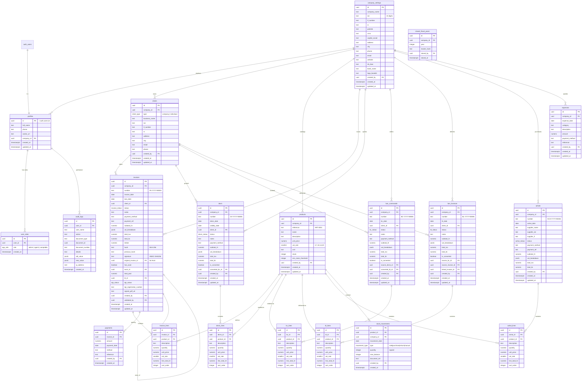

# FacturaPro — Diagramme Entité-Relation

```mermaid
erDiagram
    auth_users ||--|| profiles : "1:1"
    profiles ||--o{ user_roles : "has roles"
    
    company_settings ||--o{ profiles : "employs"
    company_settings ||--o{ clients : "owns"
    company_settings ||--o{ products : "catalogs"
    company_settings ||--o{ invoices : "issues"
    company_settings ||--o{ devis : "quotes"
    company_settings ||--o{ bon_commande : "orders"
    company_settings ||--o{ bon_livraison : "delivers"
    company_settings ||--o{ achats : "purchases"
    company_settings ||--o{ expenses : "spends"

    clients ||--o{ invoices : "billed"
    clients ||--o{ devis : "quoted"
    clients ||--o{ bon_commande : "ordered"
    clients ||--o{ bon_livraison : "delivered"

    invoices ||--o{ invoice_lines : "contains"
    invoices ||--o{ payments : "paid by"
    invoices ||--o| invoices : "avoir_of"

    devis ||--o{ devis_lines : "contains"
    bon_commande ||--o{ bc_lines : "contains"
    bon_livraison ||--o{ bl_lines : "contains"
    achats ||--o{ achat_lines : "contains"

    products ||--o{ invoice_lines : "sold as"
    products ||--o{ devis_lines : "quoted as"
    products ||--o{ bc_lines : "ordered as"
    products ||--o{ bl_lines : "delivered as"
    products ||--o{ achat_lines : "purchased as"
    products ||--o{ stock_movements : "tracked"

    profiles ||--o{ audit_logs : "performed"

    profiles {
        uuid id PK "= auth.users.id"
        text full_name
        text phone
        text avatar_url
        uuid company_id FK
        timestamptz created_at
        timestamptz updated_at
    }

    user_roles {
        uuid id PK
        uuid user_id FK
        app_role role "admin | agent | comptable"
        timestamptz created_at
    }

    company_settings {
        uuid id PK
        text company_name
        text ice "15 digits"
        text if_number
        text rc
        text patente
        text cnss
        text capital_social
        text address
        text city
        text phone
        text email
        text website
        text rib_iban
        text bank_name
        text logo_base64
        uuid created_by FK
        timestamptz created_at
        timestamptz updated_at
    }

    clients {
        uuid id PK
        uuid company_id FK
        client_type type "company | individual"
        text business_name
        text ice
        text if_number
        text rc
        text address
        text city
        text email
        text phone
        uuid created_by FK
        timestamptz created_at
        timestamptz updated_at
    }

    products {
        uuid id PK
        uuid company_id FK
        text reference "ART-0001"
        text name
        text description
        numeric unit_price
        smallint vat_rate "0,7,10,14,20"
        text unit
        integer stock
        integer min_stock_threshold
        uuid created_by FK
        timestamptz created_at
        timestamptz updated_at
    }

    invoices {
        uuid id PK
        uuid company_id FK
        text number "FA-YYYY-NNNN"
        date invoice_date
        date due_date
        uuid client_id FK
        invoice_status status
        text notes
        text payment_method
        text payment_ref
        numeric subtotal_ht
        jsonb vat_breakdown
        numeric total_tva
        numeric total_ttc
        numeric timbre
        text hash "SHA-256"
        text previous_hash
        text signature "HMAC-SHA256"
        uuid original_invoice_id FK "for Avoir"
        boolean has_avoir
        uuid avoir_id FK
        numeric total_paid
        uuid bl_id FK
        dgi_status dgi_status
        text dgi_registration_number
        text signed_pdf_url
        uuid created_by FK
        uuid validated_by FK
        timestamptz created_at
        timestamptz updated_at
    }

    invoice_lines {
        uuid id PK
        uuid invoice_id FK
        uuid product_id FK
        text description
        numeric quantity
        numeric unit_price
        smallint vat_rate
        numeric line_total_ht
        integer sort_order
    }

    payments {
        uuid id PK
        uuid invoice_id FK
        numeric amount
        date payment_date
        text method
        text reference
        uuid created_by FK
        timestamptz created_at
    }

    devis {
        uuid id PK
        uuid company_id FK
        text number "DV-YYYY-NNNN"
        date devis_date
        date validity_date
        uuid client_id FK
        devis_status status
        text notes
        text payment_method
        numeric subtotal_ht
        jsonb vat_breakdown
        numeric total_tva
        numeric total_ttc
        boolean is_converted
        uuid converted_bc_id FK
        uuid created_by FK
        timestamptz created_at
        timestamptz updated_at
    }

    devis_lines {
        uuid id PK
        uuid devis_id FK
        uuid product_id FK
        text description
        numeric quantity
        numeric unit_price
        smallint vat_rate
        numeric line_total_ht
        integer sort_order
    }

    bon_commande {
        uuid id PK
        uuid company_id FK
        text number "BC-YYYY-NNNN"
        date bc_date
        uuid client_id FK
        bc_status status
        text notes
        text payment_method
        numeric subtotal_ht
        jsonb vat_breakdown
        numeric total_tva
        numeric total_ttc
        boolean is_converted
        uuid source_devis_id FK
        uuid converted_bl_id FK
        uuid created_by FK
        timestamptz created_at
        timestamptz updated_at
    }

    bc_lines {
        uuid id PK
        uuid bc_id FK
        uuid product_id FK
        text description
        numeric quantity
        numeric unit_price
        smallint vat_rate
        numeric line_total_ht
        integer sort_order
    }

    bon_livraison {
        uuid id PK
        uuid company_id FK
        text number "BL-YYYY-NNNN"
        date bl_date
        uuid client_id FK
        bl_status status
        text notes
        numeric subtotal_ht
        jsonb vat_breakdown
        numeric total_tva
        numeric total_ttc
        boolean is_converted
        uuid source_bc_id FK
        uuid source_invoice_id FK
        uuid linked_invoice_id FK
        uuid created_by FK
        timestamptz created_at
        timestamptz updated_at
    }

    bl_lines {
        uuid id PK
        uuid bl_id FK
        uuid product_id FK
        text description
        numeric quantity
        numeric unit_price
        smallint vat_rate
        numeric line_total_ht
        integer sort_order
    }

    achats {
        uuid id PK
        uuid company_id FK
        text number "ACH-YYYY-NNNN"
        date achat_date
        text supplier_name
        text supplier_ice
        text supplier_if
        achat_status status
        text payment_method
        text payment_ref
        numeric subtotal_ht
        jsonb vat_breakdown
        numeric total_tva
        numeric total_ttc
        uuid created_by FK
        timestamptz created_at
        timestamptz updated_at
    }

    achat_lines {
        uuid id PK
        uuid achat_id FK
        uuid product_id FK
        text description
        numeric quantity
        numeric unit_price
        smallint vat_rate
        numeric line_total_ht
        integer sort_order
    }

    stock_movements {
        uuid id PK
        uuid product_id FK
        uuid company_id FK
        date movement_date
        movement_type type "sale|purchase|return|manual"
        integer quantity "signed"
        integer new_balance
        text document_ref
        uuid created_by FK
        timestamptz created_at
    }

    expenses {
        uuid id PK
        uuid company_id FK
        date expense_date
        text category
        text description
        numeric amount
        text payment_method
        text reference
        uuid created_by FK
        timestamptz created_at
        timestamptz updated_at
    }

    audit_logs {
        uuid id PK
        uuid user_id FK
        text user_name
        text action
        text document_type
        uuid document_id
        text document_number
        text details
        jsonb old_value
        jsonb new_value
        inet ip_address
        timestamptz created_at
    }

    closed_fiscal_years {
        uuid id PK
        uuid company_id FK
        integer year
        text master_hash
        uuid closed_by FK
        timestamptz closed_at
    }
```
